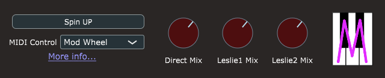

# MOrgan Cab - Leslie Cabinet simulator

**MOrgan Cab** (cabinet) is an audio-effect plug-in, which takes a stereo input signal and produces a stereo output signal. It neither accepts nor produces MIDI data.

This plug-in processes incoming audio using two different *rotary speaker* models, reminiscent of the type of ["Leslie" speaker cabinet system](https://en.wikipedia.org/wiki/Leslie_speaker) often used with Hammond organs.

- The first model adapts code from the [setBfree project](https://setbfree.org/) (see e.g. https://github.com/pantherb/setBfree), which was itself based on the paper "[Discrete Time Emulation of the Leslie Speaker](https://www.aes.org/e-lib/browse.cfm?elib=15120)" by Jorge Herrera, Craig Hanson, and Jonathan S. Abel, Presented at the 127th Convention of the Audio Engineering Society, 2009 October 9–12 New York NY, USA.
- The second model uses code originally developed by Paul Kellett as part of the [mda-vst project](http://mda.smartelectronix.com/) (see also https://github.com/topics/mda-plugins). Although the MDA Leslie effect was not a true Leslie speaker emulation, it works nicely in conjunction with the more realistic *setBfree* version.
- The plug-in includes a simple mixer to set the levels of the direct (unprocessed) signal and of the two separate Leslie effects.

## Graphical User Interface

The **MOrgan Cab** GUI is shown above. It consists of a pair of *speed controls* on the left, to select how the simulated Leslie speed is switched from slow to fast, and a group of three *mix knobs* on the right, to adjust the balance among the direct and processed signals.

#### Speed controls

- The **Spin UP/DOWN** button toggles between the "slow" and "fast" rotation speeds.
- The **MIDI Control** menu offers four choices for how input MIDI can set the speed:
  - **None**: input MIDI is ignored.
  - **Sustain Pedal**: pressing the MIDI sustain pedal (CC#64 value goes above 63) spins UP, releasing the pedal (CC#64 goes below 64) spins DOWN.
  - **Mod Wheel**: as for sustain pedal, but CC#1 (mod wheel) controls the effect.
  - **Sustain+MW**: speed responds to either/both of CC#1 and CC#64.

#### Mix knobs

- **Direct Mix** controls the amount of the unprocessed input ("direct") signal appears in the output.
- **Leslie1 Mix** controls the amount from the output of the first Leslie model (from [setBfree project](https://setbfree.org/)).
- **Leslie2 Mix** controls the amount from the output of the second Leslie model (from  [mda-vst project](http://mda.smartelectronix.com/)).

All three knobs are calibrated in dB, in the range -48 dB to +12 dB, where -48 is effectively "minus infinity", i.e., no signal (designated "OFF" in the GUI) Note there will be no output (silence) f all three mix knobs are turned all the way counterclockwise to the "off" position.

The text which appears below each knob automatically changes from the knob's *label text* to the *current value of the corresponding parameter* while the mouse is positioned over the knob. You can *double-click the text* to enter a numeric value.

- There is no need to enter the trailing "dB" unit; it will be ignored if present.
- Press the Enter (Return) key on the computer keyboard to confirm the change.
- The value you enter will be clipped to the valid range -48 to +12.

Each knob also has a designated *default value*, which for all three mix knobs is -9.75 dB (equivalent to linear scaling value of one-third).

- All parameters are initialized to their default values when you first instantiate the plug-in.
- Double-clicking any knob reverts the parameter to its default value.

## Automation parameters

The **MOrgan Cab** plug-in exposes the leslie-speed and three mix-level parameters for host automation. The **Leslie Speed** parameter is a fractional value between 0.0 and 1.0, where anything less than 0.5 sets the speed to "slow" and anything higher sets it to "fast".

The mix parameter names are the same as the corresponding knob label text as follows:

- **Direct Mix** controls the amount of the unprocessed input ("direct") signal appears in the output.
- **Leslie1 Mix** controls the amount from the output of the first Leslie model.
- **Leslie2 Mix** controls the amount from the output of the second Leslie model.

