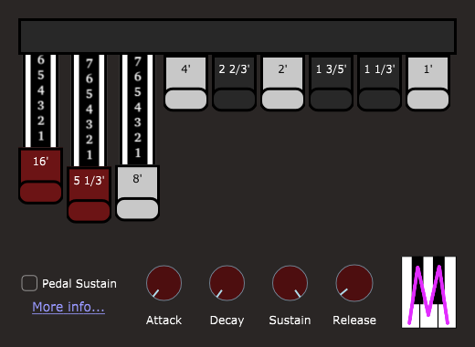

# MOrgan Osc - Tonewheel synthesizer

**MOrgan Osc** (oscillator) is an instrument plug-in, which takes MIDI input and produces audio output. It's a simple 32-voice polyphonic synthesizer producing tones reminiscent of the Hammond tone-wheel system.

Details about the Hammond tone-wheel system are beyond the scope of this description, but this information is freely and readily available on the Internet.

## Graphical User Interface

The **MOrgan Osc** GUI is shown above. It consists of nine *drawbars*, four *envelope knobs*, and a checkbox to set whether or not the synthesizer responds to the MIDI sustain pedal.

#### Drawbars

Each MOrgan oscillator uses a wave-table formed by the summation of up to nine sinusoidal *partials*, whose relative amplitudes are controlled by the nine *drawbars* in the GUI. The relative frequencies of these partials are indicated by the traditional organ footage labels (16', 5 1/3', 8', ... , 1') on the drawbars. The 8' drawbar corresponds to the ordinary pitch of each MIDI note, e.g., when A above middle C is played, the pitch of the 8' drawbar will be 440 Hz.

#### ADSR envelope knobs

Unlike the Hammond organ, the MOrgan Osc synthesizer also features a standard "ADSR" amplitude-envelope whose four parameters *attack time*, *decay time*, *sustain level*, and *release time* are controlled by the correspondingly-labeled knobs. The three time-knobs are calibrated in seconds, from 0.0 to 1.0 second, and the sustain knob is calibrated from 0 to 100 percent.

The text which appears below each knob automatically changes from the knob's *label text* to the *current value of the corresponding parameter* while the mouse is positioned over the knob. You can *double-click the text* to enter a numeric value.

- There is no need to enter the trailing "sec" or "%" unit; it will be ignored if present.
- Press the Enter (Return) key on the computer keyboard to confirm the change.
- The value you enter will be clipped to the valid range for the knob.

Each knob also has a designated *default value*.

- All parameters are initialized to their default values when you first instantiate the plug-in.
  - Attack 0.01 sec, Decay 0, Sustain 100%, Release 0.05 sec.
  - The nonzero attack and release times avoid unpleasant clicks in the output.
- Double-clicking any knob reverts the parameter to its default value.

#### Master volume knob

The *Volume* knob is calibrated from -48 dB (effectively zero volume) to +18 dB. This is primarily there to adjust the overall volume to compensate for different numbers of drawbars being used, but can also be used to fade the total sound-level down to silence when required.

#### Pedal sustain and MW vibrato checkboxes

As is conventional for organs, the synthesizer normally does not respond to MIDI sustain-pedal (CC#64), but if you check the *Pedal Sustain* box, notes will be held while the sustain pedal is down.

Checking the *MW vibrato* box allows use of the mod wheel (CC#1) to add a light vibrato.

## Automation parameters

The *MOrgan Osc* plug-in exposes the nine drawbar parameters and the four ADSR envelope parameters for host automation. The parameter names are as follows:

- *Drawbars* are called *Drawbar 16 ft*, *Drawbar 5 1-3 ft*, *Drawbar 8 ft*, *Drawbar 4 ft*, *Drawbar 2 2-3 ft*, *Drawbar 2 ft*, *Drawbar 1 3-5 ft*, *Drawbar 1 1-3 ft*, and *Drawbar 1 ft*.
- *Envelope parameters* are called *Attack*, *Decay*, *Sustain*, and *Release*.
