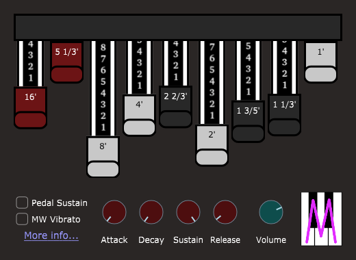

# MOrgan Osc - Tonewheel synthesizer

**MOrgan Osc** (oscillator) is an instrument plug-in, which takes MIDI input and produces audio output. It's a simple 32-voice polyphonic synthesizer producing tones reminiscent of the Hammond tonewheel system.

