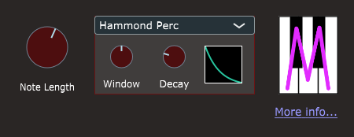
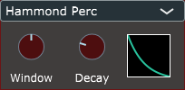

# MOrgan Perc - MIDI Percussion processor

**MOrgan Perc** (percussion) is an MIDI-effect plug-in, which takes MIDI input and produces output MIDI, but no audio output. Its purpose is to trigger any downstream instrument plug-in to produce notes in a manner reminiscent of the Hammond "key click" and "percussion" functions.

The first version of **MOrgan Perc** was specialized only for the "Hammond Perc" effect, but feedback from sound-designer [John Lehmkuhl](https://www.pluginguru.com/about/) suggested that the current three trigger-modes (described below) would yield a more useful and comprehensible effect.

### Detailed functional description

The most basic effect of the **MOrgan Perc** plug-in is to trigger precisely-timed MIDI note-on/note-off event pairs at the output, in response to note-on events received at the input. This triggering can be done in three different ways, according to the setting of the pop-up menu, as follows:

**Polyphonic** triggering simply means that *every* input note-on event gives rise to a note-on/note-off pair. The input note-on event is simply propagated to the output, so the note velocity is as played. This is useful for "key click" effects.

With **Simple Mono** triggering, *only the first input note-on* triggers a timed output note. For as long as *at least one key is held down*, further note-triggering will be suppressed. This is a simplification of the classic Hammond-organ "percussion" response, where the goal was to emphasize only the first note of legato runs or arpeggiated chords.

**Hammond Perc** triggering provides more realistic modeling of the the classic Hammond "percussion" effect. These organs featured a "percussion" circuit, which was a type of one-shot oscillator triggered by pressing one or more keys following an all-keys-up condition. When triggered, the circuit produced an output voltage which began at its maximum value, and quickly decayed to zero. This voltage controlled the value of a percussive click sound generated for each key which was depressed. The resulting effect was that the percussion click was *polyphonic* (one click would be heard for each of several keys depressed roughly simultaneously), but *mono-triggered* (once triggered by the first key down, the output voltage would quickly decay to zero, so the click volume for subsequent keys would rapidly drop). Practically, this meant that the percussion clicks would only be heard for the first note or chord struck, and no further clicks would sound for as long as at least one key was held down.

**MOrgan Perc** models this very specific behavior. It has an internal one-shot oscillator using a wave-table filled with an exponential-decay curve (as shown by the green graph trace in the GUI). This oscillator is triggered only by the first MIDI key-down event following an all-keys-up condition, and its output rapidly decays from unity (1.0) to zero. MIDI key-down events received by the plug-in will be allowed through to the output only for the duration of the oscillator cycle (called the *Window*), and their MIDI velocity value will be scaled by its instantaneous output value.

**MOrgan Perc** will most commonly be routed to filter the MIDI stream to a synthesizer plug-in configured to produce a short "pluck" or click-like sound, but as it produces output note-on/note-off sequences, even sustaining sounds can be used.

## Graphical User Interface

The **MOrgan Perc** GUI is shown above. It consists of a **Note Length** knob (which always controls how much later, in milliseconds, each generated note-off event occurs after the corresponding note-on), and a cluster of *triggering controls* in the middle:

The triggering cluster consists of a consists of a pop-up menu to select one of the three *trigger modes* described above, and two *timing knobs* and a *graph display*, which are visible only in the "Hammond Perc" mode.

#### Timing knobs

- The **Note Length** knob controls the length of the triggered note (i.e., the time difference between the generated MIDI note-on and the corresponding note-off). It is calibrated in milliseconds, with a range of 10 to 250 msec, and a default value of 50 msec.
- The **Window** knob controls the internal one-shot oscillator's cycle time. It is calibrated in milliseconds, with a range of 50 to 250 msec, and a default value of 150 msec.
- The **Decay** knob controls the curvature of the oscillator's exponential decay. It is calibrated in arbitrary units from 0.05 (nearly linear) to 10.0 (very curved), with default value 2.5.

The text which appears below each knob automatically changes from the knob's *label text* to the *current value of the corresponding parameter* while the mouse is positioned over the knob. You can *double-click the text* to enter a numeric value.

- There is no need to enter the trailing "sec" or "%" unit; it will be ignored if present.
- Press the Enter (Return) key on the computer keyboard to confirm the change.
- The value you enter will be clipped to the valid range for the knob.

Each knob also has a designated *default value*.

- All parameters are initialized to their default values when you first instantiate the plug-in.
- Double-clicking any knob reverts the parameter to its default value.

#### Graph display

The graph displays a curve illustrating the current shape of the internal oscillator's wave table.

## Automation parameters

The **MOrgan Perc** plug-in exposes *Note Length*, *Window* and *Decay* parameters, so named.
